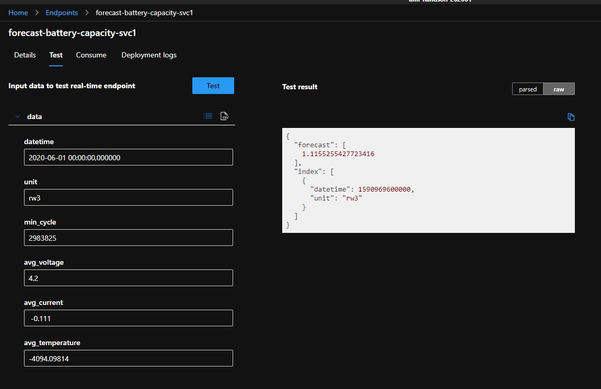
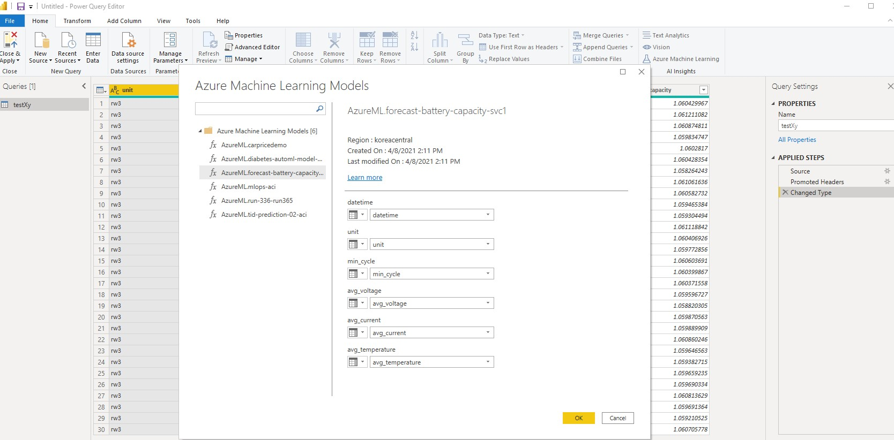

# Synapse-AML-Battery-Forecasting

## Introduction

Azure ML의 주요 기능을 데모/실습을 통해 파악하고, 배터리 수명 관련 공개데이터를 이용해 Forecasting을 수행해봅니다.

## Strategy

- 실습은 AzureML의 Compute Instance로 활용해서 실습하는 것으로 하되,
- 데모는 VSCode도 확인해봅니다.
  - [VSCode로 CI에 직접 붙는 것](https://docs.microsoft.com/en-us/azure/machine-learning/how-to-set-up-vs-code-remote?tabs=extension)
  - [VSCode의 Remote connection 기능](https://code.visualstudio.com/docs/remote/ssh#:~:text=To%20connect%20to%20a%20remote%20host%20for%20the,select%20the%20type%20manually.%20...%20More%20items...%20)
  - [VSCode에서 extension 이용해 Azure ML 활용하는 부분](https://docs.microsoft.com/en-us/azure/machine-learning/tutorial-setup-vscode-extension)
  - [VSCode에서 SDK로 제출하는 부분](https://docs.microsoft.com/en-us/azure/machine-learning/how-to-configure-environment#local)

## Part 1

기본 사항들 준비/확인

- 기본 실습내용 진행
  - Azure ML Workspace 만들기 (공용)
  - Compute Instance (개별), Computer Cluster 생성하기
  - Notebooks - Terminal에서 `git clone https://github.com/azure/machinelearningnotebooks`
  - 첫번째 실험 (local)
  - MNIST/sklearn 학습 (remote) /배포

- 당뇨진단 회귀분석 케이스
  - 학습 및 배포: 아래 3가지 중에서 선택
    - [Automated ML로 학습하기](https://docs.microsoft.com/en-us/azure/machine-learning/tutorial-power-bi-automated-model)
    - [Designer로 학습하기](https://docs.microsoft.com/en-us/azure/machine-learning/tutorial-power-bi-designer-model)
    - [Code로 학습하기](https://docs.microsoft.com/en-us/azure/machine-learning/tutorial-power-bi-custom-model)
  - [Power BI로 예측 수행](https://docs.microsoft.com/en-us/power-bi/connect-data/service-aml-integrate?context=azure/machine-learning/context/ml-context)

## Part 2

배터리 데이터로 Forecasting 수행

- 데이터 준비/가공
  - 원 데이터 + 가공된 데이터: Blob에 public으로 [업로드](https://synapseaikorcenpublic.blob.core.windows.net/share/dataset_rw3/)
  - [가공 로직 .ipynb](code/01-transform-data-in-synapse.ipynb): Synapse에 import하여 실행
  - [Azure ML에 Dataset으로 등록 로직 .ipynb](code/02-register-aml-dataset.ipynb): Synapse에서 import하거나 Azure ML CI에서 실행

- 실험 수행 - 모델 생성
  - Automated ML / UI 활용
  - D13_V2: 8 core / 56 GB RAM

- 모델 평가
  - explanation 분석하는 부분에 시간 할애

- 모델 패키지/배포
  - UI에서 수행 (참고: [일반 튜토리얼](https://docs.microsoft.com/en-us/azure/machine-learning/tutorial-automated-ml-forecast))
    - Frequency: Auto
    - Forecast horizon: 30
    - Forecast target lags: 비움 ([0])
    - Target rolling window size: 비움 (0)
  - 참고: [SDK에서 수행](https://docs.microsoft.com/en-us/azure/machine-learning/how-to-auto-train-forecast)

- 모델 사용 ([SDK 참고](https://github.com/Azure/MachineLearningNotebooks/blob/master/how-to-use-azureml/automated-machine-learning/forecasting-orange-juice-sales/auto-ml-forecasting-orange-juice-sales.ipynb))
  - UI에서 확인
    
  - [SDK 이용하여 Forecast 예측하는 .ipynb](code/04-deploy-consume-model.ipynb): Azure ML CI에서 실행
  - (TBD) 위 로직을 이용하면 Synapse에서 Power BI로 함께 시각화 가능
  - Power BI에서 직접 ML 모델 이용해 시각화하는 예제는 [Part 1](#part-1) 참고하여, [sample data](sample\testXy.csv)에 대해 진행
    

    > TODO: sample data의 기간을 좀더 늘여보도록 함

## Part 3

기타 주요 기능 확인/데모

- [Automatic Featurization](https://docs.microsoft.com/en-us/azure/machine-learning/how-to-configure-auto-features#featurization)
- Many Models approach: [Solution Accelerator](https://github.com/microsoft/solution-accelerator-many-models), [agl Energy case](https://customers.microsoft.com/en-us/story/844796-agl-energy-azure)
- Designer
- Pipeline
- MLOps with Azure DevOps
- Data Drift Monitoring
- Explore [ML Notebooks GitHub repo](https://github.com/Azure/MachineLearningNotebooks)
- Explore [Azure ML examples GitHub repo](https://github.com/Azure/azureml-examples)

## Contribute

TODO: Explain how other users and developers can contribute to make your code better.

If you want to learn more about creating good readme files then refer the following [guidelines](https://docs.microsoft.com/en-us/azure/devops/repos/git/create-a-readme?view=azure-devops). You can also seek inspiration from the below readme files:

- [ASP.NET Core](https://github.com/aspnet/Home)
- [Visual Studio Code](https://github.com/Microsoft/vscode)
- [Chakra Core](https://github.com/Microsoft/ChakraCore)
